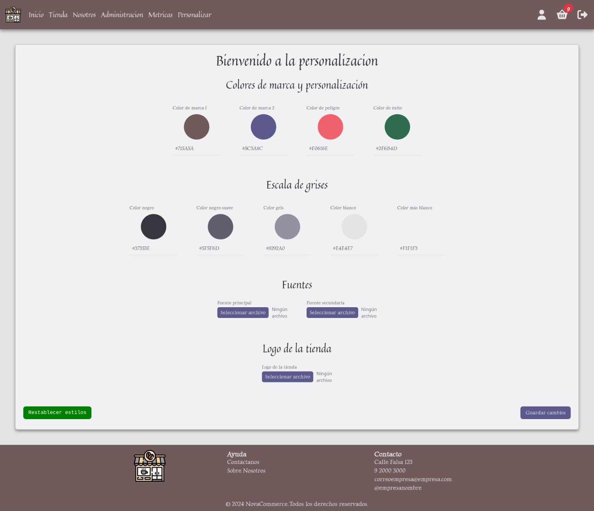
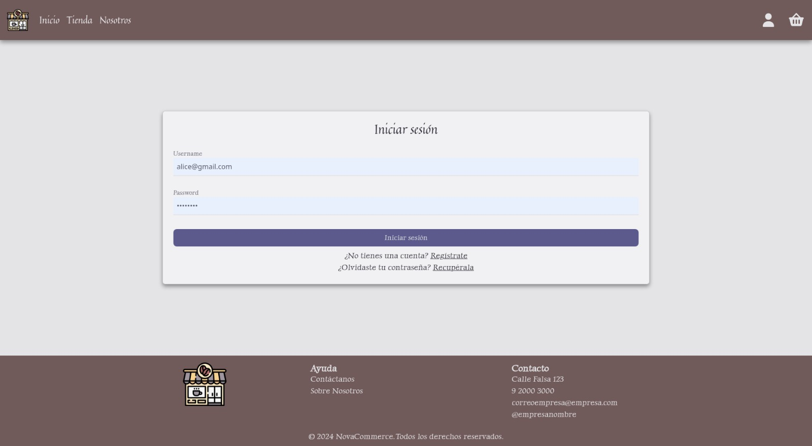
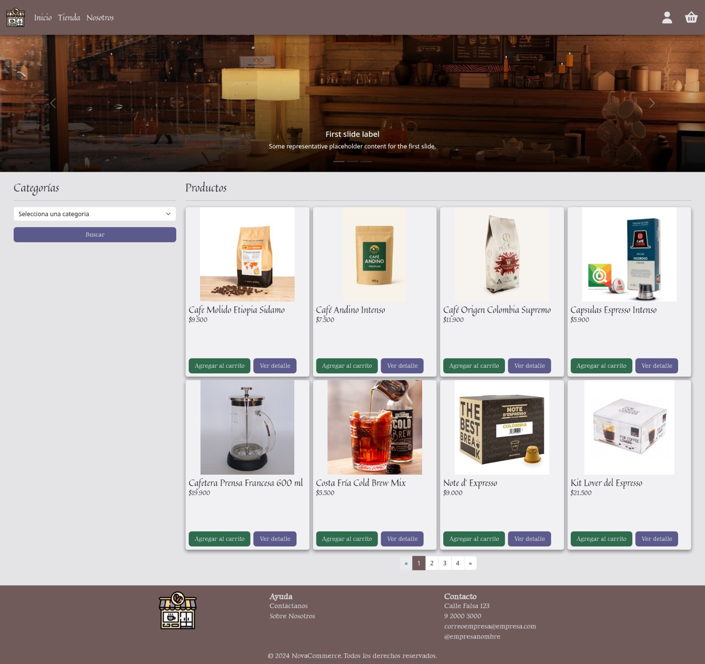
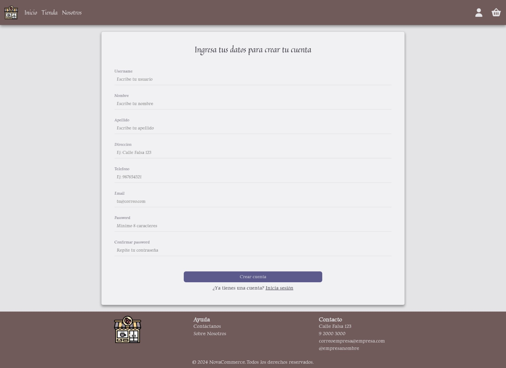

# 🛒 Novacommerce: Plataforma E-commerce White-label (Showcase)

> **Nota:** Este repositorio es una vitrina del proyecto. Debido a políticas de privacidad del equipo de desarrollo y fines académicos, el código fuente completo se mantiene en un repositorio privado. Aquí se expone la arquitectura, funcionalidades y mi contribución técnica.

# NovaCommerce-Showcaseh  

## 📄 Descripción del Proyecto
**Novacommerce** es una solución de comercio electrónico diseñada para PYMES que buscan digitalizar sus ventas sin perder su identidad de marca.

A diferencia de un e-commerce tradicional, Novacommerce funciona como una plataforma **"White-label"** (marca blanca). Permite que cada negocio configure dinámicamente su **paleta de colores, tipografías y logotipos**, adaptando la interfaz automáticamente gracias a un motor de plantillas avanzado.

Este fue mi **Proyecto de Título** para la carrera de Ingeniería en Informática, desarrollado bajo una metodología tradicional en Cascada para asegurar una documentación y arquitectura robusta.

## 🛠️ Stack Tecnológico

* **Backend:** Python, Django.
* **Base de Datos:** MySQL.
* **Templating Engine:** Jinja.
* **Frontend:** HTML5, CSS, JavaScript, Bootstrap.
* **Herramientas:** Git, Visual Studio Code.

## ✨ Funcionalidades Clave

### 1. Personalización de Marca (Feature Estrella) 🎨
El sistema permite al administrador del negocio subir sus assets de marca y definir colores primarios/secundarios.
* **Técnica:** Uso de variables de contexto en **Django** inyectadas en plantillas **Jinja2** y generación de variables CSS en tiempo de ejecución.
* **Resultado:** La tienda cambia de apariencia instantáneamente sin tocar el código fuente.

### 2. Gestión de Inventario y Ventas 📦
* CRUD completo de productos con categorías.
* Control de stock en tiempo real.
* Panel de administración para seguimiento de pedidos.

### 3. Carrito de Compras Seguro 🛒
* Flujo de compra intuitivo.
* Gestión de sesiones de usuario.

## 👩‍💻 Mi Contribución Técnica
Como parte del equipo de desarrollo, mis roles principales fueron:

1.  **Arquitectura Backend (Django):** Diseño de modelos de base de datos relacionales (Model-View-Template) para soportar múltiples configuraciones de tienda.
2.  **Motor de Personalización:** Desarrollé la lógica que intercepta la configuración del usuario y renderiza los estilos CSS dinámicos usando **Jinja2**.
3.  **Base de Datos (MySQL):** Optimización de consultas y estructura de tablas para productos y usuarios.
4.  **Aseguramiento de Calidad:** Pruebas funcionales de los módulos críticos.

## 📸 Galería del Proyecto

### Vista: Login

### Vista: Tienda 

### Vista: Registro

---
### 📬 Contacto
Si te interesa conocer más sobre la lógica detrás de este proyecto o ver fragmentos de código específicos, ¡no dudes en contactarme!

**Jennifer Celedón**
* [LinkedIn](https://www.linkedin.com/in/jenny-celedon)
* [Email](mailto:jennyy20999@gmail.com)
